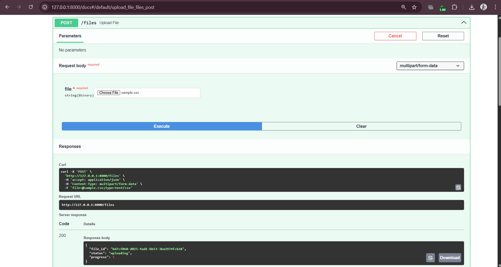
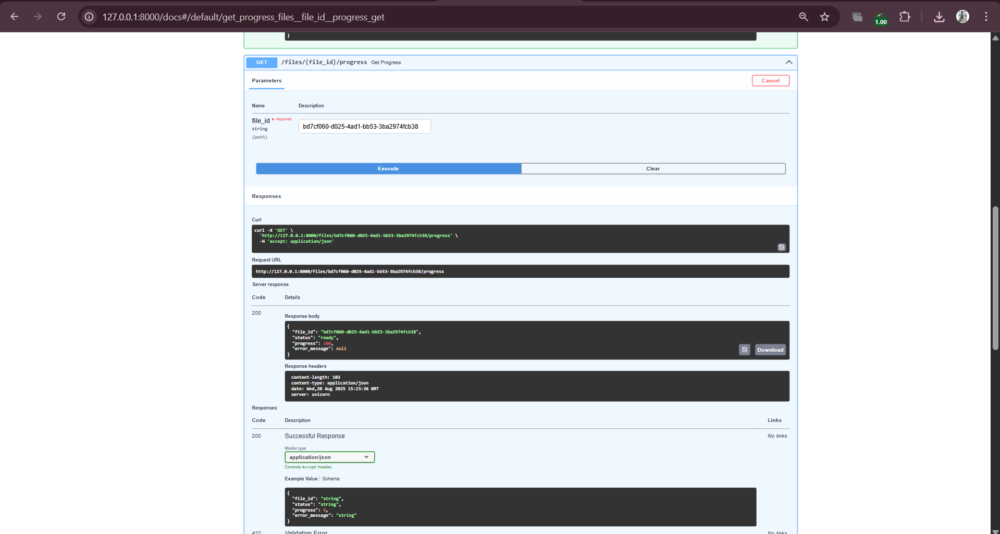
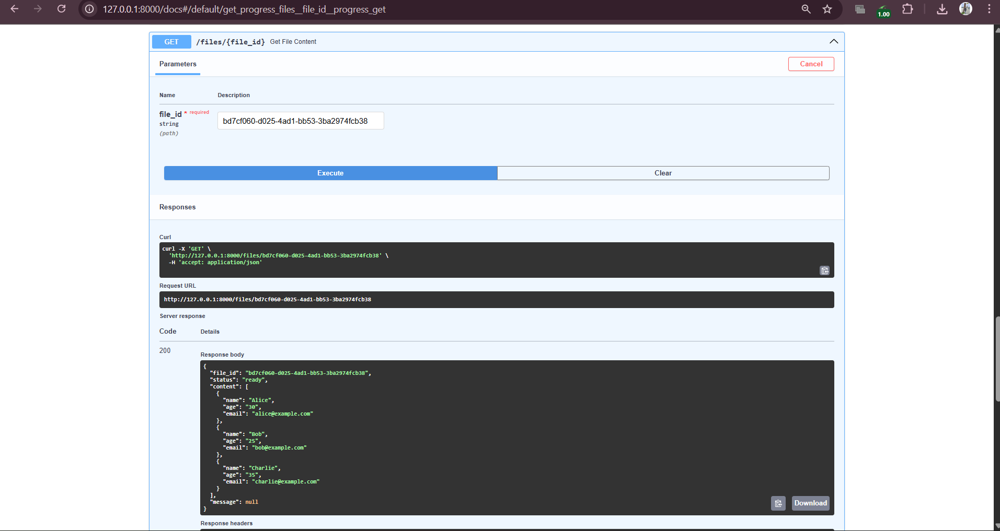
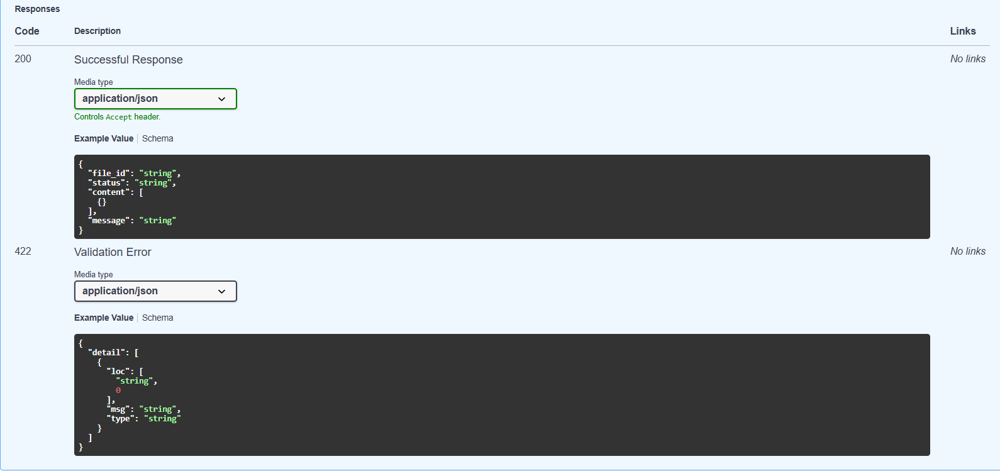
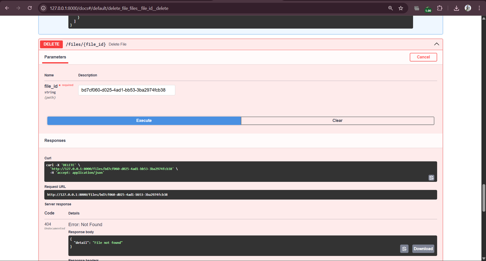

# 📂 File Parser CRUD API with Progress Tracking

A backend application built with **FastAPI** that supports uploading, parsing, and retrieving files (CSV, Excel, PDF, Text) with **real-time progress tracking**. The solution also includes **CRUD operations** for managing uploaded files.

---

## ✨ Features  

- ✅ **File Upload API** – Upload CSV, Excel, PDF, or Text files.  
- ✅ **Progress Tracking** – Check file upload & parsing progress in real time.  
- ✅ **Asynchronous Parsing** – Handles large files without blocking the API.  
- ✅ **Parsed Content API** – Retrieve parsed file content as JSON.  
- ✅ **CRUD Operations** – List and delete uploaded files.  
- ✅ **SQLite Database** – Stores metadata, status, and parsed content.  
- ✅ **Interactive Docs** – Swagger UI & ReDoc included by FastAPI.  

---

## 📸 Screenshots  

| Feature | Screenshot |
|---------|------------|
| Upload File |  |
| Progress Tracking |  |
| Parsed Content |  |
| Parsed Content |  |
| Delete File |  |
! Database Structure | [Database Tables](screenshots/db_tables.png)


## ⚙️ Tech Stack  

- **Backend Framework**: [FastAPI](https://fastapi.tiangolo.com/)  
- **Database**: SQLite (via SQLAlchemy ORM)  
- **Task Handling**: Background tasks in FastAPI (async)  
- **File Parsing**: Pandas (CSV, Excel), PyPDF2 (PDF), Text parser  
- **Auth (Optional)**: JWT (can be extended)  

---

## 🚀 Setup Instructions  

1. **Clone the repository**  
   ```bash
   git clone https://github.com/your-username/file-parser-crud-api.git
   cd file-parser-crud-api
   ```

2. **Create a virtual environment**  
   ```bash
   python -m venv .venv
   source .venv/bin/activate   # On Linux/Mac
   .venv\Scripts\activate      # On Windows
   ```

3. **Install dependencies**  
   ```bash
   pip install -r requirements.txt
   ```

4. **Run the application**  
   ```bash
   uvicorn main:app --reload
   ```

5. **Open API Docs**  
   - Swagger UI → [http://127.0.0.1:8000/docs](http://127.0.0.1:8000/docs)  
   - ReDoc → [http://127.0.0.1:8000/redoc](http://127.0.0.1:8000/redoc)  

---

## 📡 API Documentation  

### 1️⃣ Upload File  
**POST** `/files`  

Example Response:  
```json
{
  "file_id": "c7d2a442-6a57-47d7-9d57-fb8712882dcf",
  "filename": "employees.csv",
  "status": "uploading"
}
```

### 2️⃣ Track File Progress  
**GET** `/files/{file_id}/progress`  

Example Response:  
```json
{
  "file_id": "c7d2a442-6a57-47d7-9d57-fb8712882dcf",
  "status": "ready",
  "progress": 100,
  "error_message": null
}
```

### 3️⃣ Get Parsed File Content  
**GET** `/files/{file_id}`  

Example Response:  
```json
[
  { "id": 1, "name": "John Doe", "department": "Engineering", "age": 29, "email": "john.doe@company.com" },
  { "id": 2, "name": "Jane Smith", "department": "Marketing", "age": 34, "email": "jane.smith@company.com" }
]
```

### 4️⃣ List All Files  
**GET** `/files`  

Example Response:  
```json
[
  {
    "file_id": "c7d2a442-6a57-47d7-9d57-fb8712882dcf",
    "filename": "employees.csv",
    "status": "ready",
    "created_at": "2025-08-20T12:34:56"
  }
]
```

### 5️⃣ Delete File  
**DELETE** `/files/{file_id}`  

Example Response:  
```json
{ "message": "File deleted successfully" }
```

---

## 📊 Sample Data (employees.csv)  

```csv
id,name,department,age,email
1,John Doe,Engineering,29,john.doe@company.com
2,Jane Smith,Marketing,34,jane.smith@company.com
3,Michael Johnson,Finance,41,michael.johnson@company.com
4,Emily Davis,HR,27,emily.davis@company.com
5,David Wilson,Engineering,38,david.wilson@company.com
```

---

"Happy Coding! 🚀 Contributions and feedback are always welcome."
